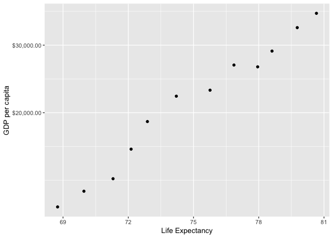

## Setup

```
## ── Attaching packages ─────────────────────────────────────────────────────────────────── tidyverse 1.2.1 ──
```

```
## ✔ ggplot2 3.1.1     ✔ purrr   0.3.2
## ✔ tibble  2.1.3     ✔ dplyr   0.8.3
## ✔ tidyr   0.8.3     ✔ stringr 1.4.0
## ✔ readr   1.3.1     ✔ forcats 0.4.0
```

```
## ── Conflicts ────────────────────────────────────────────────────────────────────── tidyverse_conflicts() ──
## ✖ dplyr::filter() masks stats::filter()
## ✖ dplyr::lag()    masks stats::lag()
```

## _Exercise 1_ Basic dplyr
__1.1__

```
##    country continent year  lifeExp       pop  gdpPercap
## 1:  Canada  Americas 1972 72.88000  22284500 18970.5709
## 2:  Canada  Americas 1977 74.21000  23796400 22090.8831
## 3:   China      Asia 1972 63.11888 862030000   676.9001
## 4:   China      Asia 1977 63.96736 943455000   741.2375
## 5:   Japan      Asia 1972 73.42000 107188273 14778.7864
## 6:   Japan      Asia 1977 75.38000 113872473 16610.3770
```

__1.2__

```
##    country  gdpPercap
## 1:  Canada 18970.5709
## 2:  Canada 22090.8831
## 3:   China   676.9001
## 4:   China   741.2375
## 5:   Japan 14778.7864
## 6:   Japan 16610.3770
```

__1.3__

```
##       country continent year lifeExp      pop gdpPercap increaseInlifeExp
##   1:  Albania    Europe 1992  71.581  3326498 2497.4379            -0.419
##   2:   Angola    Africa 1987  39.906  7874230 2430.2083            -0.036
##   3:    Benin    Africa 2002  54.406  7026113 1372.8779            -0.371
##   4: Botswana    Africa 1992  62.745  1342614 7954.1116            -0.877
##   5: Botswana    Africa 1997  52.556  1536536 8647.1423           -10.189
##  ---                                                                     
##  98:   Zambia    Africa 1997  40.238  9417789 1071.3538            -5.862
##  99:   Zambia    Africa 2002  39.193 10595811 1071.6139            -1.045
## 100: Zimbabwe    Africa 1992  60.377 10704340  693.4208            -1.974
## 101: Zimbabwe    Africa 1997  46.809 11404948  792.4500           -13.568
## 102: Zimbabwe    Africa 2002  39.989 11926563  672.0386            -6.820
```

__

__1.4__

```
##                 country continent year lifeExp      pop  gdpPercap
##   1:        Afghanistan      Asia 1982  39.854 12881816   978.0114
##   2:            Albania    Europe 2007  76.423  3600523  5937.0295
##   3:            Algeria    Africa 2007  72.301 33333216  6223.3675
##   4:             Angola    Africa 1967  35.985  5247469  5522.7764
##   5:          Argentina  Americas 2007  75.320 40301927 12779.3796
##  ---                                                              
## 138:            Vietnam      Asia 2007  74.249 85262356  2441.5764
## 139: West Bank and Gaza      Asia 1997  71.096  2826046  7110.6676
## 140:        Yemen, Rep.      Asia 2007  62.698 22211743  2280.7699
## 141:             Zambia    Africa 1967  47.768  3900000  1777.0773
## 142:           Zimbabwe    Africa 1972  55.635  5861135   799.3622
```

__1.5__


<!-- -->


