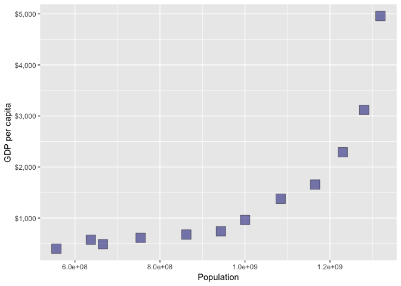

# hw2.0-Gapminder and dplyr
## author: "Xuan Lin"
## date: '2019-09-21'


## Setup

```
## ── Attaching packages ─────────────────────────────────────────────────────────────────── tidyverse 1.2.1 ──
```

```
## ✔ ggplot2 3.1.1     ✔ purrr   0.3.2
## ✔ tibble  2.1.3     ✔ dplyr   0.8.3
## ✔ tidyr   0.8.3     ✔ stringr 1.4.0
## ✔ readr   1.3.1     ✔ forcats 0.4.0
```

```
## ── Conflicts ────────────────────────────────────────────────────────────────────── tidyverse_conflicts() ──
## ✖ dplyr::filter() masks stats::filter()
## ✖ dplyr::lag()    masks stats::lag()
```

## _Exercise 1_ Basic dplyr
### 1.1


__Table 1.1 Life expectancy, population and GDP in Canada, China and Japan (1970's)__


country   continent    year    lifeExp         pop    gdpPercap
--------  ----------  -----  ---------  ----------  -----------
Canada    Americas     1972   72.88000    22284500   18970.5709
Canada    Americas     1977   74.21000    23796400   22090.8831
China     Asia         1972   63.11888   862030000     676.9001
China     Asia         1977   63.96736   943455000     741.2375
Japan     Asia         1972   73.42000   107188273   14778.7864
Japan     Asia         1977   75.38000   113872473   16610.3770


### 1.2

__Table 1.2 GDP in Canada, China and Japan (1970's)__


country     gdpPercap
--------  -----------
Canada     18970.5709
Canada     22090.8831
China        676.9001
China        741.2375
Japan      14778.7864
Japan      16610.3770


### 1.3

__Table 1.3 Countries experienced a drop in life expectancy (1952-2007)__

<!--html_preserve--><div id="htmlwidget-1e3c0e0507044c61aa2b" style="width:100%;height:auto;" class="datatables html-widget"></div>
<script type="application/json" data-for="htmlwidget-1e3c0e0507044c61aa2b">{"x":{"filter":"none","data":[["1","2","3","4","5","6","7","8","9","10","11","12","13","14","15","16","17","18","19","20","21","22","23","24","25","26","27","28","29","30","31","32","33","34","35","36","37","38","39","40","41","42","43","44","45","46","47","48","49","50","51","52","53","54","55","56","57","58","59","60","61","62","63","64","65","66","67","68","69","70","71","72","73","74","75","76","77","78","79","80","81","82","83","84","85","86","87","88","89","90","91","92","93","94","95","96","97"],["Albania","Benin","Botswana","Botswana","Botswana","Bulgaria","Bulgaria","Bulgaria","Burundi","Cambodia","Cambodia","Cameroon","Cameroon","Cameroon","Central African Republic","Central African Republic","Central African Republic","Chad","Chad","China","Congo, Dem. Rep.","Congo, Dem. Rep.","Congo, Dem. Rep.","Congo, Rep.","Congo, Rep.","Cote d'Ivoire","Cote d'Ivoire","Cote d'Ivoire","Croatia","Czech Republic","Denmark","El Salvador","El Salvador","Eritrea","Gabon","Gabon","Ghana","Hungary","Hungary","Iraq","Iraq","Iraq","Jamaica","Kenya","Kenya","Kenya","Korea, Dem. Rep.","Korea, Dem. Rep.","Korea, Dem. Rep.","Lesotho","Lesotho","Lesotho","Liberia","Malawi","Malawi","Montenegro","Mozambique","Mozambique","Myanmar","Namibia","Namibia","Netherlands","Nigeria","Norway","Poland","Poland","Puerto Rico","Romania","Romania","Rwanda","Rwanda","Serbia","Sierra Leone","Slovak Republic","Somalia","South Africa","South Africa","South Africa","Swaziland","Swaziland","Swaziland","Tanzania","Tanzania","Togo","Trinidad and Tobago","Trinidad and Tobago","Uganda","Uganda","Uganda","Uganda","Zambia","Zambia","Zambia","Zambia","Zimbabwe","Zimbabwe","Zimbabwe"],["Europe","Africa","Africa","Africa","Africa","Europe","Europe","Europe","Africa","Asia","Asia","Africa","Africa","Africa","Africa","Africa","Africa","Africa","Africa","Asia","Africa","Africa","Africa","Africa","Africa","Africa","Africa","Africa","Europe","Europe","Europe","Americas","Americas","Africa","Africa","Africa","Africa","Europe","Europe","Asia","Asia","Asia","Americas","Africa","Africa","Africa","Asia","Asia","Asia","Africa","Africa","Africa","Africa","Africa","Africa","Europe","Africa","Africa","Asia","Africa","Africa","Europe","Africa","Europe","Europe","Europe","Americas","Europe","Europe","Africa","Africa","Europe","Africa","Europe","Africa","Africa","Africa","Africa","Africa","Africa","Africa","Africa","Africa","Africa","Americas","Americas","Africa","Africa","Africa","Africa","Africa","Africa","Africa","Africa","Africa","Africa","Africa"],[1992,2002,1992,1997,2002,1977,1992,1997,1992,1972,1977,1992,1997,2002,1992,1997,2002,1997,2002,1962,1987,1992,1997,1992,1997,1992,1997,2002,1982,1972,1982,1977,1982,1982,1997,2002,2002,1982,1992,1992,1997,2002,2002,1992,1997,2002,1992,1997,2002,1997,2002,2007,1992,1997,2002,2002,2002,2007,2002,1997,2002,1972,2002,1987,1977,1987,1992,1987,1992,1987,1992,1982,1992,1972,1992,1997,2002,2007,1997,2002,2007,1992,1997,2002,1997,2002,1977,1982,1992,1997,1987,1992,1997,2002,1992,1997,2002],[71.581,54.406,62.745,52.556,46.634,70.81,71.19,70.32,44.736,40.317,31.22,54.314,52.199,49.856,49.396,46.066,43.308,51.573,50.525,44.50136,47.412,45.548,42.587,56.433,52.962,52.044,47.991,46.832,70.46,70.29,74.63,56.696,56.604,43.89,60.461,56.761,58.453,69.39,69.17,59.461,58.811,57.046,72.047,59.285,54.407,50.992,69.978,67.727,66.662,55.558,44.593,42.592,40.802,47.495,45.009,73.981,44.026,42.082,59.908,58.909,51.479,73.75,46.608,75.89,70.67,70.98,73.911,69.53,69.36,44.02,23.599,70.162,38.333,70.35,39.658,60.236,53.365,49.339,54.289,43.869,39.613,50.44,48.466,57.561,69.465,68.976,50.35,49.849,48.825,44.578,50.821,46.1,40.238,39.193,60.377,46.809,39.989],[3326498,7026113,1342614,1536536,1630347,8797022,8658506,8066057,5809236,7450606,6978607,12467171,14195809,15929988,3265124,3696513,4048013,7562011,8835739,665770000,35481645,41672143,47798986,2409073,2800947,12772596,14625967,16252726,4413368,9862158,5117810,4282586,4474873,2637297,1126189,1299304,20550751,10705535,10348684,17861905,20775703,24001816,2664659,25020539,28263827,31386842,20711375,21585105,22215365,1982823,2046772,2012649,1912974,10419991,11824495,720230,18473780,19951656,45598081,1774766,1972153,13329874,119901274,4186147,34621254,37740710,3585176,22686371,22797027,6349365,7290203,9032824,4260884,4593433,6099799,42835005,44433622,43997828,1054486,1130269,1133066,26605473,30686889,4977378,1138101,1101832,11457758,12939400,18252190,21210254,7272406,8381163,9417789,10595811,10704340,11404948,11926563],[2497.437901,1372.877931,7954.111645,8647.142313,11003.60508,7612.240438,6302.623438,5970.38876,631.6998778,421.6240257,524.9721832,1793.163278,1694.337469,1934.011449,747.9055252,740.5063317,738.6906068,1004.961353,1156.18186,487.6740183,672.774812,457.7191807,312.188423,4016.239529,3484.164376,1648.073791,1786.265407,1648.800823,13221.82184,13108.4536,21688.04048,5138.922374,4098.344175,524.8758493,14722.84188,12521.71392,1111.984578,12545.99066,10535.62855,3745.640687,3076.239795,4390.717312,6994.774861,1341.921721,1360.485021,1287.514732,3726.063507,1690.756814,1646.758151,1186.147994,1275.184575,1569.331442,636.6229191,692.2758103,665.4231186,6557.194282,633.6179466,823.6856205,611,3899.52426,4072.324751,18794.74567,1615.286395,31540.9748,9508.141454,9082.351172,14641.58711,9696.273295,6598.409903,847.991217,737.0685949,15181.0927,1068.696278,9674.167626,926.9602964,7479.188244,7710.946444,9269.657808,3876.76846,4128.116943,4513.480643,825.682454,789.1862231,886.2205765,8792.573126,11460.60023,843.7331372,682.2662268,644.1707969,816.559081,1213.315116,1210.884633,1071.353818,1071.613938,693.4207856,792.4499603,672.0386227],[-0.4,-0.4,-0.9,-10.2,-5.9,-0.1,-0.2,-0.9,-3.5,-5.1,-9.1,-0.7,-2.1,-2.3,-1.1,-3.3,-2.8,-0.2,-1,-6,-0.4,-1.9,-3,-1,-3.5,-2.6,-4.1,-1.2,-0.2,-0.1,-0.1,-1.5,-0.1,-0.6,-0.9,-3.7,-0.1,-0.6,-0.4,-5.6,-0.6,-1.8,-0.2,-0.1,-4.9,-3.4,-0.7,-2.3,-1.1,-4.1,-11,-2,-5.2,-1.9,-2.5,-1.5,-2.3,-1.9,-0.4,-3.1,-7.4,-0.1,-0.9,-0.1,-0.2,-0.3,-0.7,-0.1,-0.2,-2.2,-20.4,-0.1,-1.7,-0.6,-4.8,-1.7,-6.9,-4,-4.2,-10.4,-4.3,-1.1,-2,-0.8,-0.4,-0.5,-0.7,-0.5,-2.7,-4.2,-1,-4.7,-5.9,-1,-2,-13.6,-6.8]],"container":"<table class=\"display\">\n  <thead>\n    <tr>\n      <th> <\/th>\n      <th>country<\/th>\n      <th>continent<\/th>\n      <th>year<\/th>\n      <th>lifeExp<\/th>\n      <th>pop<\/th>\n      <th>gdpPercap<\/th>\n      <th>increaseInlifeExp<\/th>\n    <\/tr>\n  <\/thead>\n<\/table>","options":{"columnDefs":[{"className":"dt-right","targets":[3,4,5,6,7]},{"orderable":false,"targets":0}],"order":[],"autoWidth":false,"orderClasses":false}},"evals":[],"jsHooks":[]}</script><!--/html_preserve-->


### 1.4

__Table 1.4 Maximum GDP experienced by each country (1952-2007)__

<!--html_preserve--><div id="htmlwidget-be2ed8f59b3679234e78" style="width:100%;height:auto;" class="datatables html-widget"></div>
<script type="application/json" data-for="htmlwidget-be2ed8f59b3679234e78">{"x":{"filter":"none","data":[["1","2","3","4","5","6","7","8","9","10","11","12","13","14","15","16","17","18","19","20","21","22","23","24","25","26","27","28","29","30","31","32","33","34","35","36","37","38","39","40","41","42","43","44","45","46","47","48","49","50","51","52","53","54","55","56","57","58","59","60","61","62","63","64","65","66","67","68","69","70","71","72","73","74","75","76","77","78","79","80","81","82","83","84","85","86","87","88","89","90","91","92","93","94","95","96","97","98","99","100","101","102","103","104","105","106","107","108","109","110","111","112","113","114","115","116","117","118","119","120","121","122","123","124","125","126","127","128","129","130","131","132","133","134","135","136","137","138","139","140","141","142"],["Afghanistan","Albania","Algeria","Angola","Argentina","Australia","Austria","Bahrain","Bangladesh","Belgium","Benin","Bolivia","Bosnia and Herzegovina","Botswana","Brazil","Bulgaria","Burkina Faso","Burundi","Cambodia","Cameroon","Canada","Central African Republic","Chad","Chile","China","Colombia","Comoros","Congo, Dem. Rep.","Congo, Rep.","Costa Rica","Cote d'Ivoire","Croatia","Cuba","Czech Republic","Denmark","Djibouti","Dominican Republic","Ecuador","Egypt","El Salvador","Equatorial Guinea","Eritrea","Ethiopia","Finland","France","Gabon","Gambia","Germany","Ghana","Greece","Guatemala","Guinea","Guinea-Bissau","Haiti","Honduras","Hong Kong, China","Hungary","Iceland","India","Indonesia","Iran","Iraq","Ireland","Israel","Italy","Jamaica","Japan","Jordan","Kenya","Korea, Dem. Rep.","Korea, Rep.","Kuwait","Lebanon","Lesotho","Liberia","Libya","Madagascar","Malawi","Malaysia","Mali","Mauritania","Mauritius","Mexico","Mongolia","Montenegro","Morocco","Mozambique","Myanmar","Namibia","Nepal","Netherlands","New Zealand","Nicaragua","Niger","Nigeria","Norway","Oman","Pakistan","Panama","Paraguay","Peru","Philippines","Poland","Portugal","Puerto Rico","Reunion","Romania","Rwanda","Sao Tome and Principe","Saudi Arabia","Senegal","Serbia","Sierra Leone","Singapore","Slovak Republic","Slovenia","Somalia","South Africa","Spain","Sri Lanka","Sudan","Swaziland","Sweden","Switzerland","Syria","Taiwan","Tanzania","Thailand","Togo","Trinidad and Tobago","Tunisia","Turkey","Uganda","United Kingdom","United States","Uruguay","Venezuela","Vietnam","West Bank and Gaza","Yemen, Rep.","Zambia","Zimbabwe"],["Asia","Europe","Africa","Africa","Americas","Oceania","Europe","Asia","Asia","Europe","Africa","Americas","Europe","Africa","Americas","Europe","Africa","Africa","Asia","Africa","Americas","Africa","Africa","Americas","Asia","Americas","Africa","Africa","Africa","Americas","Africa","Europe","Americas","Europe","Europe","Africa","Americas","Americas","Africa","Americas","Africa","Africa","Africa","Europe","Europe","Africa","Africa","Europe","Africa","Europe","Americas","Africa","Africa","Americas","Americas","Asia","Europe","Europe","Asia","Asia","Asia","Asia","Europe","Asia","Europe","Americas","Asia","Asia","Africa","Asia","Asia","Asia","Asia","Africa","Africa","Africa","Africa","Africa","Asia","Africa","Africa","Africa","Americas","Asia","Europe","Africa","Africa","Asia","Africa","Asia","Europe","Oceania","Americas","Africa","Africa","Europe","Asia","Asia","Americas","Americas","Americas","Asia","Europe","Europe","Americas","Africa","Europe","Africa","Africa","Asia","Africa","Europe","Africa","Asia","Europe","Europe","Africa","Africa","Europe","Asia","Africa","Africa","Europe","Europe","Asia","Asia","Africa","Asia","Africa","Americas","Africa","Europe","Africa","Europe","Americas","Americas","Americas","Asia","Asia","Asia","Africa","Africa"],[1982,2007,2007,1967,2007,2007,2007,2007,2007,2007,2007,2007,2007,2007,2007,2007,2007,1992,2007,1987,2007,1962,2007,2007,2007,2007,1972,1957,1982,2007,1982,2007,2007,2007,2007,1972,2007,1997,2007,2007,2007,1997,2007,2007,2007,1977,1977,2007,2007,2007,2007,2002,1982,1982,2007,2007,2007,2007,2007,2007,1977,1977,2007,2007,2007,1972,2007,2007,2007,1982,2007,1957,2007,2007,1972,1977,1972,2007,2007,2007,2007,2007,2007,2007,1987,2007,2007,2007,2007,2007,2007,2007,1977,1967,2007,2007,2007,2007,2007,1982,2007,2007,2007,2007,2007,2007,2007,1982,1982,1977,2007,1987,1982,2007,2007,2007,1977,2007,2007,2007,2007,2007,2007,2007,2007,2007,2007,2007,1972,2007,2007,2007,2007,2007,2007,2007,1977,2007,1997,2007,1967,1972],[39.854,76.423,72.301,35.985,75.32,81.235,79.829,75.635,64.062,79.441,56.728,65.554,74.852,50.728,72.39,73.005,52.295,44.736,59.723,54.985,80.653,39.475,50.651,78.553,72.961,72.889,48.944,40.652,56.695,78.782,53.983,75.748,78.273,76.486,78.332,44.366,72.235,72.312,71.338,71.878,51.579,53.378,52.947,79.313,80.657,52.79,41.842,79.406,60.022,79.483,70.259,53.676,39.327,51.461,70.198,82.208,73.338,81.757,64.698,70.65,57.702,60.413,78.885,80.745,80.546,69,82.603,72.535,54.11,69.1,78.623,58.033,71.993,42.592,42.614,57.442,44.851,48.303,74.241,54.467,64.164,72.801,76.195,66.803,74.865,71.164,42.082,62.069,52.906,63.785,79.762,80.204,57.47,40.118,46.859,80.196,75.64,65.483,75.537,66.874,71.421,71.688,75.563,78.098,78.746,76.442,72.476,46.218,60.351,58.69,63.062,71.218,38.445,79.972,74.663,77.926,41.974,49.339,80.941,72.396,58.556,39.613,80.884,81.701,74.143,78.4,52.517,70.616,49.759,69.819,73.923,71.777,51.542,79.425,78.242,76.384,67.456,74.249,71.096,62.698,47.768,55.635],[12881816,3600523,33333216,5247469,40301927,20434176,8199783,708573,150448339,10392226,8078314,9119152,4552198,1639131,190010647,7322858,14326203,5809236,14131858,10780667,33390141,1523478,10238807,16284741,1318683096,44227550,250027,15577932,1774735,4133884,9025951,4493312,11416987,10228744,5468120,178848,9319622,11911819,80264543,6939688,551201,4058319,76511887,5238460,61083916,706367,608274,82400996,22873338,10706290,12572928,8807818,825987,5198399,7483763,6980412,9956108,301931,1110396331,223547000,35480679,11882916,4109086,6426679,58147733,1997616,127467972,6053193,35610177,17647518,49044790,212846,3921278,2012649,1482628,2721783,7082430,13327079,24821286,12031795,3270065,1250882,108700891,2874127,569473,33757175,19951656,47761980,2055080,28901790,16570613,4115771,2554598,4534062,135031164,4627926,3204897,169270617,3242173,3366439,28674757,91077287,38518241,10642836,3942491,798094,22276056,5507565,98593,8128505,12267493,9230783,3464522,4553009,5447502,2009245,4353666,43997828,40448191,20378239,42292929,1133066,9031088,7554661,19314747,23174294,38139640,65068149,2056351,1056608,10276158,71158647,29170398,60776238,301139947,3447496,13503563,85262356,2826046,22211743,3900000,5861135],[978.0114388,5937.029526,6223.367465,5522.776375,12779.37964,34435.36744,36126.4927,29796.04834,1391.253792,33692.60508,1441.284873,3822.137084,7446.298803,12569.85177,9065.800825,10680.79282,1217.032994,631.6998778,1713.778686,2602.664206,36319.23501,1193.068753,1704.063724,13171.63885,4959.114854,7006.580419,1937.577675,905.8602303,4879.507522,9645.06142,2602.710169,14619.22272,8948.102923,22833.30851,35278.41874,3694.212352,6025.374752,7429.455877,5581.180998,5728.353514,12154.08975,913.47079,690.8055759,33207.0844,30470.0167,21745.57328,884.7552507,32170.37442,1327.60891,27538.41188,5186.050003,945.5835837,838.1239671,2011.159549,3548.330846,39724.97867,18008.94444,36180.78919,2452.210407,3540.651564,11888.59508,14688.23507,40675.99635,25523.2771,28569.7197,7433.889293,31656.06806,4519.461171,1463.249282,4106.525293,23348.13973,113523.1329,10461.05868,1569.331442,803.0054535,21951.21176,1748.562982,759.3499101,12451.6558,1042.581557,1803.151496,10956.99112,11977.57496,3095.772271,11732.51017,3820.17523,823.6856205,944,4811.060429,1091.359778,36797.93332,25185.00911,5486.371089,1054.384891,2013.977305,49357.19017,22316.19287,2605.94758,9809.185636,4258.503604,7408.905561,3190.481016,15389.92468,20509.64777,19328.70901,7670.122558,10808.47561,881.5706467,1890.218117,34167.7626,1712.472136,15870.87851,1465.010784,47143.17964,18678.31435,25768.25759,1450.992513,9269.657808,28821.0637,3970.095407,2602.394995,4513.480643,33859.74835,37506.41907,4184.548089,28718.27684,1107.482182,7458.396327,1649.660188,18008.50924,7092.923025,8458.276384,1056.380121,33203.26128,42951.65309,10611.46299,13143.95095,2441.576404,7110.667619,2280.769906,1777.077318,799.3621758]],"container":"<table class=\"display\">\n  <thead>\n    <tr>\n      <th> <\/th>\n      <th>country<\/th>\n      <th>continent<\/th>\n      <th>year<\/th>\n      <th>lifeExp<\/th>\n      <th>pop<\/th>\n      <th>gdpPercap<\/th>\n    <\/tr>\n  <\/thead>\n<\/table>","options":{"columnDefs":[{"className":"dt-right","targets":[3,4,5,6]},{"orderable":false,"targets":0}],"order":[],"autoWidth":false,"orderClasses":false}},"evals":[],"jsHooks":[]}</script><!--/html_preserve-->


### 1.5


<!-- -->

__Fig 1.1 Relationship between life expectancy and GDP in Canada (1952-2007)__

## _Exercise 2_ Explore individual variables with dplyr

__Table 2.1 Minimum and maximum life expetancy each year__


 year   lifeExp
-----  --------
 1952    28.801
 1952    72.670
 1957    30.332
 1957    73.470
 1962    31.997
 1962    73.680
 1967    34.020
 1967    74.160
 1972    35.400
 1972    74.720
 1977    31.220
 1977    76.110
 1982    38.445
 1982    77.110
 1987    39.906
 1987    78.670
 1992    23.599
 1992    79.360
 1997    36.087
 1997    80.690
 2002    39.193
 2002    82.000
 2007    39.613
 2007    82.603


<!-- -->

__Fig 2.1 Boxplot of life expectancy each year (1952-2007)__

## _Exercise 3_ Explore various plot types
### Scatterplot


<!-- -->


__Fig 3.1 Relationship between Chinese population and GDP per capita (1952 - 2007)__


### Boxplot

<!-- -->


__Fig 3.2 Difference in GDP per capita with different range of population (2007)__
