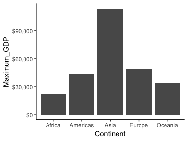
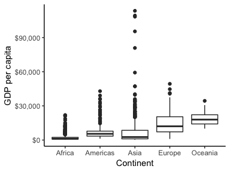
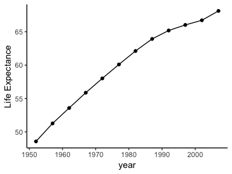

```
## ── Attaching packages ─────────────────────────────────────── tidyverse 1.2.1 ──
```

```
## ✔ ggplot2 3.1.1     ✔ purrr   0.3.2
## ✔ tibble  2.1.3     ✔ dplyr   0.8.3
## ✔ tidyr   0.8.3     ✔ stringr 1.4.0
## ✔ readr   1.3.1     ✔ forcats 0.4.0
```

```
## ── Conflicts ────────────────────────────────────────── tidyverse_conflicts() ──
## ✖ dplyr::filter() masks stats::filter()
## ✖ dplyr::lag()    masks stats::lag()
```

## 1. Task Option 2
Table 1 shows the maximum and minimum GDP per capita in period of 1952 to 2007 for all continents. Fig. 1 shows the maximum GDP per capita reported in period of 1952 to 2007 for all continents, Asia was reportd to create the highest GDP per capita in this period.

__Table 1 Maximun and minimun GDP per capita for all continents (1952-2007)__


continent    Maximum_GDP   Minimum_GDP
----------  ------------  ------------
Africa          21951.21      241.1659
Americas        42951.65     1201.6372
Asia           113523.13      331.0000
Europe          49357.19      973.5332
Oceania         34435.37    10039.5956

<!-- -->

__Fig. 1 Maximum GDP per Capita for all continents (1952-2007)__

## 2. Task Option 3
Table 2 shows the spread of GDP per capita within the continents for period of 1952 to 2007. Largest variance was observed in Asia. The same observation can also be concluded from the boxplot of GDP per capita within the continents from 1952 to 2007 (Fig. 2), with the most outliers observed in Asia.

__Table 2 Spread of GDP per capita within the continents (1952-2007)__


continent        Range    Variance   Standard_Deviation   Inner_Quartile_Range
----------  ----------  ----------  -------------------  ---------------------
Africa        21710.05     7997187             2827.930               1616.170
Americas      41750.02    40918591             6396.764               4402.431
Asia         113192.13   197272506            14045.373               7492.262
Europe        48383.66    87520020             9355.213              13248.301
Oceania       24395.77    40436669             6358.983               8072.258

<!-- -->

__Fig. 2 Boxplot of GDP per capita within the continents (1952-2007)__

## 3. Task Option 4
A 10% trimmed mean was calculated for each statistical year from year 1952 to 2007, and the results were shown in Table 3 and Fig. 3. A continuous increase in average life expectancy was observed from 1952 to 2007.

__Table 3 Trimmed mean of life expectancy for year 1952 to 2007__

 year   trimmed_mean
-----  -------------
 1952       48.57668
 1957       51.26888
 1962       53.58075
 1967       55.86538
 1972       58.01444
 1977       60.10206
 1982       62.11694
 1987       63.92106
 1992       65.18519
 1997       66.01736
 2002       66.71641
 2007       68.11489

<!-- -->

__Fig. 3 Change in life expactancy (1952-2007), each data point represents the trimmed mean for each year__

