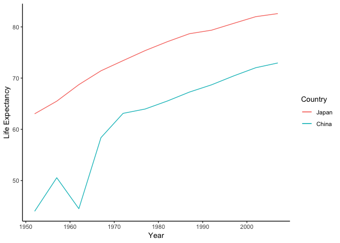

```r
library(gapminder)
library(tidyverse)
```

```
## ── Attaching packages ─────────────────────────────────────────────────────────────────────────────────────────── tidyverse 1.2.1 ──
```

```
## ✔ ggplot2 3.1.1     ✔ purrr   0.3.2
## ✔ tibble  2.1.3     ✔ dplyr   0.8.3
## ✔ tidyr   1.0.0     ✔ stringr 1.4.0
## ✔ readr   1.3.1     ✔ forcats 0.4.0
```

```
## ── Conflicts ────────────────────────────────────────────────────────────────────────────────────────────── tidyverse_conflicts() ──
## ✖ dplyr::filter() masks stats::filter()
## ✖ dplyr::lag()    masks stats::lag()
```

## Exercise 1: Univariate Data Reshaping (Option 1)

### _1.1_

__Description__

We are interested in the life exectancies in Asian countries from year 1952 to 2007. The original _gapminder_ dataset presents each year and contry in seperate rows which makes comparison of life expectancy of different countries in the same year somehow difficult. The following table filtered out Asian countries and re-organized the columns so that direct comparison of life expectancy in the same year can be easily achieved.


```r
gapminder %>% 
  filter(continent == "Asia") %>% 
  pivot_wider(id_cols = year, names_from = country, values_from = lifeExp) %>% 
  DT::datatable()
```

<!--html_preserve--><div id="htmlwidget-3d901977512595fe8bdf" style="width:100%;height:auto;" class="datatables html-widget"></div>
<script type="application/json" data-for="htmlwidget-3d901977512595fe8bdf">{"x":{"filter":"none","data":[["1","2","3","4","5","6","7","8","9","10","11","12"],[1952,1957,1962,1967,1972,1977,1982,1987,1992,1997,2002,2007],[28.801,30.332,31.997,34.02,36.088,38.438,39.854,40.822,41.674,41.763,42.129,43.828],[50.939,53.832,56.923,59.923,63.3,65.593,69.052,70.75,72.601,73.925,74.795,75.635],[37.484,39.348,41.216,43.453,45.252,46.923,50.009,52.819,56.018,59.412,62.013,64.062],[39.417,41.366,43.415,45.415,40.317,31.22,50.957,53.914,55.803,56.534,56.752,59.723],[44,50.54896,44.50136,58.38112,63.11888,63.96736,65.525,67.274,68.69,70.426,72.028,72.961],[60.96,64.75,67.65,70,72,73.6,75.45,76.2,77.601,80,81.495,82.208],[37.373,40.249,43.605,47.193,50.651,54.208,56.596,58.553,60.223,61.765,62.879,64.698],[37.468,39.918,42.518,45.964,49.203,52.702,56.159,60.137,62.681,66.041,68.588,70.65],[44.869,47.181,49.325,52.469,55.234,57.702,59.62,63.04,65.742,68.042,69.451,70.964],[45.32,48.437,51.457,54.459,56.95,60.413,62.038,65.044,59.461,58.811,57.046,59.545],[65.39,67.84,69.39,70.75,71.63,73.06,74.45,75.6,76.93,78.269,79.696,80.745],[63.03,65.5,68.73,71.43,73.42,75.38,77.11,78.67,79.36,80.69,82,82.603],[43.158,45.669,48.126,51.629,56.528,61.134,63.739,65.869,68.015,69.772,71.263,72.535],[50.056,54.081,56.656,59.942,63.983,67.159,69.1,70.647,69.978,67.727,66.662,67.297],[47.453,52.681,55.292,57.716,62.612,64.766,67.123,69.81,72.244,74.647,77.045,78.623],[55.565,58.033,60.47,64.624,67.712,69.343,71.309,74.174,75.19,76.156,76.904,77.588],[55.928,59.489,62.094,63.87,65.421,66.099,66.983,67.926,69.292,70.265,71.028,71.993],[48.463,52.102,55.737,59.371,63.01,65.256,68,69.5,70.693,71.938,73.044,74.241],[42.244,45.248,48.251,51.253,53.754,55.491,57.489,60.222,61.271,63.625,65.033,66.803],[36.319,41.905,45.108,49.379,53.07,56.059,58.056,58.339,59.32,60.328,59.908,62.069],[36.157,37.686,39.393,41.472,43.971,46.748,49.594,52.537,55.727,59.426,61.34,63.785],[37.578,40.08,43.165,46.988,52.143,57.367,62.728,67.734,71.197,72.499,74.193,75.64],[43.436,45.557,47.67,49.8,51.929,54.043,56.158,58.245,60.838,61.818,63.61,65.483],[47.752,51.334,54.757,56.393,58.065,60.06,62.082,64.151,66.458,68.564,70.303,71.688],[39.875,42.868,45.914,49.901,53.886,58.69,63.012,66.295,68.768,70.533,71.626,72.777],[60.396,63.179,65.798,67.946,69.521,70.795,71.76,73.56,75.788,77.158,78.77,79.972],[57.593,61.456,62.192,64.266,65.042,65.949,68.757,69.011,70.379,70.457,70.815,72.396],[45.883,48.284,50.305,53.655,57.296,61.195,64.59,66.974,69.249,71.527,73.053,74.143],[58.5,62.4,65.2,67.5,69.39,70.59,72.16,73.4,74.26,75.25,76.99,78.4],[50.848,53.63,56.061,58.285,60.405,62.494,64.597,66.084,67.298,67.521,68.564,70.616],[40.412,42.887,45.363,47.838,50.254,55.764,58.816,62.82,67.662,70.672,73.017,74.249],[43.16,45.671,48.127,51.631,56.532,60.765,64.406,67.046,69.718,71.096,72.37,73.422],[32.548,33.97,35.18,36.984,39.848,44.175,49.113,52.922,55.599,58.02,60.308,62.698]],"container":"<table class=\"display\">\n  <thead>\n    <tr>\n      <th> <\/th>\n      <th>year<\/th>\n      <th>Afghanistan<\/th>\n      <th>Bahrain<\/th>\n      <th>Bangladesh<\/th>\n      <th>Cambodia<\/th>\n      <th>China<\/th>\n      <th>Hong Kong, China<\/th>\n      <th>India<\/th>\n      <th>Indonesia<\/th>\n      <th>Iran<\/th>\n      <th>Iraq<\/th>\n      <th>Israel<\/th>\n      <th>Japan<\/th>\n      <th>Jordan<\/th>\n      <th>Korea, Dem. Rep.<\/th>\n      <th>Korea, Rep.<\/th>\n      <th>Kuwait<\/th>\n      <th>Lebanon<\/th>\n      <th>Malaysia<\/th>\n      <th>Mongolia<\/th>\n      <th>Myanmar<\/th>\n      <th>Nepal<\/th>\n      <th>Oman<\/th>\n      <th>Pakistan<\/th>\n      <th>Philippines<\/th>\n      <th>Saudi Arabia<\/th>\n      <th>Singapore<\/th>\n      <th>Sri Lanka<\/th>\n      <th>Syria<\/th>\n      <th>Taiwan<\/th>\n      <th>Thailand<\/th>\n      <th>Vietnam<\/th>\n      <th>West Bank and Gaza<\/th>\n      <th>Yemen, Rep.<\/th>\n    <\/tr>\n  <\/thead>\n<\/table>","options":{"columnDefs":[{"className":"dt-right","targets":[1,2,3,4,5,6,7,8,9,10,11,12,13,14,15,16,17,18,19,20,21,22,23,24,25,26,27,28,29,30,31,32,33,34]},{"orderable":false,"targets":0}],"order":[],"autoWidth":false,"orderClasses":false}},"evals":[],"jsHooks":[]}</script><!--/html_preserve-->

__Table 1 Life expectancy in Asia (wide format)__

### _1.2_

__Description__

We then compare life expectancy in China and Japan by plotting them together. The red and blue lines show life expectancy in China and Japan, respectively.


```r
gapminder %>% 
  filter(continent == "Asia") %>% 
  pivot_wider(id_cols = year, names_from = country, values_from = lifeExp) %>% 
  ggplot(aes(x=year)) +
  geom_line(aes(y= China, color = "red")) +
  geom_line(aes(y= Japan, color= "blue")) +
  scale_y_continuous("Life Expectancy") +
  scale_color_discrete("Country", labels = c("Japan", "China")) +
  scale_x_continuous("Year") +
  theme_classic()
```

<!-- -->

__Fig.1 Life expectancy in China and Japan (1952-2007)__

### _1.3_

__Description__

We finally re-organize the wide table made in the first step back to the original format.


```r
gapminder %>% 
  filter(continent == "Asia") %>% 
  pivot_wider(id_cols = year, names_from = country, values_from = lifeExp) %>% 
  pivot_longer(cols = -year, names_to = "country", values_to = "lifeExp") %>% 
  DT::datatable()
```

<!--html_preserve--><div id="htmlwidget-b48f4e44acfd6d12e3fa" style="width:100%;height:auto;" class="datatables html-widget"></div>
<script type="application/json" data-for="htmlwidget-b48f4e44acfd6d12e3fa">{"x":{"filter":"none","data":[["1","2","3","4","5","6","7","8","9","10","11","12","13","14","15","16","17","18","19","20","21","22","23","24","25","26","27","28","29","30","31","32","33","34","35","36","37","38","39","40","41","42","43","44","45","46","47","48","49","50","51","52","53","54","55","56","57","58","59","60","61","62","63","64","65","66","67","68","69","70","71","72","73","74","75","76","77","78","79","80","81","82","83","84","85","86","87","88","89","90","91","92","93","94","95","96","97","98","99","100","101","102","103","104","105","106","107","108","109","110","111","112","113","114","115","116","117","118","119","120","121","122","123","124","125","126","127","128","129","130","131","132","133","134","135","136","137","138","139","140","141","142","143","144","145","146","147","148","149","150","151","152","153","154","155","156","157","158","159","160","161","162","163","164","165","166","167","168","169","170","171","172","173","174","175","176","177","178","179","180","181","182","183","184","185","186","187","188","189","190","191","192","193","194","195","196","197","198","199","200","201","202","203","204","205","206","207","208","209","210","211","212","213","214","215","216","217","218","219","220","221","222","223","224","225","226","227","228","229","230","231","232","233","234","235","236","237","238","239","240","241","242","243","244","245","246","247","248","249","250","251","252","253","254","255","256","257","258","259","260","261","262","263","264","265","266","267","268","269","270","271","272","273","274","275","276","277","278","279","280","281","282","283","284","285","286","287","288","289","290","291","292","293","294","295","296","297","298","299","300","301","302","303","304","305","306","307","308","309","310","311","312","313","314","315","316","317","318","319","320","321","322","323","324","325","326","327","328","329","330","331","332","333","334","335","336","337","338","339","340","341","342","343","344","345","346","347","348","349","350","351","352","353","354","355","356","357","358","359","360","361","362","363","364","365","366","367","368","369","370","371","372","373","374","375","376","377","378","379","380","381","382","383","384","385","386","387","388","389","390","391","392","393","394","395","396"],[1952,1952,1952,1952,1952,1952,1952,1952,1952,1952,1952,1952,1952,1952,1952,1952,1952,1952,1952,1952,1952,1952,1952,1952,1952,1952,1952,1952,1952,1952,1952,1952,1952,1957,1957,1957,1957,1957,1957,1957,1957,1957,1957,1957,1957,1957,1957,1957,1957,1957,1957,1957,1957,1957,1957,1957,1957,1957,1957,1957,1957,1957,1957,1957,1957,1957,1962,1962,1962,1962,1962,1962,1962,1962,1962,1962,1962,1962,1962,1962,1962,1962,1962,1962,1962,1962,1962,1962,1962,1962,1962,1962,1962,1962,1962,1962,1962,1962,1962,1967,1967,1967,1967,1967,1967,1967,1967,1967,1967,1967,1967,1967,1967,1967,1967,1967,1967,1967,1967,1967,1967,1967,1967,1967,1967,1967,1967,1967,1967,1967,1967,1967,1972,1972,1972,1972,1972,1972,1972,1972,1972,1972,1972,1972,1972,1972,1972,1972,1972,1972,1972,1972,1972,1972,1972,1972,1972,1972,1972,1972,1972,1972,1972,1972,1972,1977,1977,1977,1977,1977,1977,1977,1977,1977,1977,1977,1977,1977,1977,1977,1977,1977,1977,1977,1977,1977,1977,1977,1977,1977,1977,1977,1977,1977,1977,1977,1977,1977,1982,1982,1982,1982,1982,1982,1982,1982,1982,1982,1982,1982,1982,1982,1982,1982,1982,1982,1982,1982,1982,1982,1982,1982,1982,1982,1982,1982,1982,1982,1982,1982,1982,1987,1987,1987,1987,1987,1987,1987,1987,1987,1987,1987,1987,1987,1987,1987,1987,1987,1987,1987,1987,1987,1987,1987,1987,1987,1987,1987,1987,1987,1987,1987,1987,1987,1992,1992,1992,1992,1992,1992,1992,1992,1992,1992,1992,1992,1992,1992,1992,1992,1992,1992,1992,1992,1992,1992,1992,1992,1992,1992,1992,1992,1992,1992,1992,1992,1992,1997,1997,1997,1997,1997,1997,1997,1997,1997,1997,1997,1997,1997,1997,1997,1997,1997,1997,1997,1997,1997,1997,1997,1997,1997,1997,1997,1997,1997,1997,1997,1997,1997,2002,2002,2002,2002,2002,2002,2002,2002,2002,2002,2002,2002,2002,2002,2002,2002,2002,2002,2002,2002,2002,2002,2002,2002,2002,2002,2002,2002,2002,2002,2002,2002,2002,2007,2007,2007,2007,2007,2007,2007,2007,2007,2007,2007,2007,2007,2007,2007,2007,2007,2007,2007,2007,2007,2007,2007,2007,2007,2007,2007,2007,2007,2007,2007,2007,2007],["Afghanistan","Bahrain","Bangladesh","Cambodia","China","Hong Kong, China","India","Indonesia","Iran","Iraq","Israel","Japan","Jordan","Korea, Dem. Rep.","Korea, Rep.","Kuwait","Lebanon","Malaysia","Mongolia","Myanmar","Nepal","Oman","Pakistan","Philippines","Saudi Arabia","Singapore","Sri Lanka","Syria","Taiwan","Thailand","Vietnam","West Bank and Gaza","Yemen, Rep.","Afghanistan","Bahrain","Bangladesh","Cambodia","China","Hong Kong, China","India","Indonesia","Iran","Iraq","Israel","Japan","Jordan","Korea, Dem. Rep.","Korea, Rep.","Kuwait","Lebanon","Malaysia","Mongolia","Myanmar","Nepal","Oman","Pakistan","Philippines","Saudi Arabia","Singapore","Sri Lanka","Syria","Taiwan","Thailand","Vietnam","West Bank and Gaza","Yemen, Rep.","Afghanistan","Bahrain","Bangladesh","Cambodia","China","Hong Kong, China","India","Indonesia","Iran","Iraq","Israel","Japan","Jordan","Korea, Dem. Rep.","Korea, Rep.","Kuwait","Lebanon","Malaysia","Mongolia","Myanmar","Nepal","Oman","Pakistan","Philippines","Saudi Arabia","Singapore","Sri Lanka","Syria","Taiwan","Thailand","Vietnam","West Bank and Gaza","Yemen, Rep.","Afghanistan","Bahrain","Bangladesh","Cambodia","China","Hong Kong, China","India","Indonesia","Iran","Iraq","Israel","Japan","Jordan","Korea, Dem. Rep.","Korea, Rep.","Kuwait","Lebanon","Malaysia","Mongolia","Myanmar","Nepal","Oman","Pakistan","Philippines","Saudi Arabia","Singapore","Sri Lanka","Syria","Taiwan","Thailand","Vietnam","West Bank and Gaza","Yemen, Rep.","Afghanistan","Bahrain","Bangladesh","Cambodia","China","Hong Kong, China","India","Indonesia","Iran","Iraq","Israel","Japan","Jordan","Korea, Dem. Rep.","Korea, Rep.","Kuwait","Lebanon","Malaysia","Mongolia","Myanmar","Nepal","Oman","Pakistan","Philippines","Saudi Arabia","Singapore","Sri Lanka","Syria","Taiwan","Thailand","Vietnam","West Bank and Gaza","Yemen, Rep.","Afghanistan","Bahrain","Bangladesh","Cambodia","China","Hong Kong, China","India","Indonesia","Iran","Iraq","Israel","Japan","Jordan","Korea, Dem. Rep.","Korea, Rep.","Kuwait","Lebanon","Malaysia","Mongolia","Myanmar","Nepal","Oman","Pakistan","Philippines","Saudi Arabia","Singapore","Sri Lanka","Syria","Taiwan","Thailand","Vietnam","West Bank and Gaza","Yemen, Rep.","Afghanistan","Bahrain","Bangladesh","Cambodia","China","Hong Kong, China","India","Indonesia","Iran","Iraq","Israel","Japan","Jordan","Korea, Dem. Rep.","Korea, Rep.","Kuwait","Lebanon","Malaysia","Mongolia","Myanmar","Nepal","Oman","Pakistan","Philippines","Saudi Arabia","Singapore","Sri Lanka","Syria","Taiwan","Thailand","Vietnam","West Bank and Gaza","Yemen, Rep.","Afghanistan","Bahrain","Bangladesh","Cambodia","China","Hong Kong, China","India","Indonesia","Iran","Iraq","Israel","Japan","Jordan","Korea, Dem. Rep.","Korea, Rep.","Kuwait","Lebanon","Malaysia","Mongolia","Myanmar","Nepal","Oman","Pakistan","Philippines","Saudi Arabia","Singapore","Sri Lanka","Syria","Taiwan","Thailand","Vietnam","West Bank and Gaza","Yemen, Rep.","Afghanistan","Bahrain","Bangladesh","Cambodia","China","Hong Kong, China","India","Indonesia","Iran","Iraq","Israel","Japan","Jordan","Korea, Dem. Rep.","Korea, Rep.","Kuwait","Lebanon","Malaysia","Mongolia","Myanmar","Nepal","Oman","Pakistan","Philippines","Saudi Arabia","Singapore","Sri Lanka","Syria","Taiwan","Thailand","Vietnam","West Bank and Gaza","Yemen, Rep.","Afghanistan","Bahrain","Bangladesh","Cambodia","China","Hong Kong, China","India","Indonesia","Iran","Iraq","Israel","Japan","Jordan","Korea, Dem. Rep.","Korea, Rep.","Kuwait","Lebanon","Malaysia","Mongolia","Myanmar","Nepal","Oman","Pakistan","Philippines","Saudi Arabia","Singapore","Sri Lanka","Syria","Taiwan","Thailand","Vietnam","West Bank and Gaza","Yemen, Rep.","Afghanistan","Bahrain","Bangladesh","Cambodia","China","Hong Kong, China","India","Indonesia","Iran","Iraq","Israel","Japan","Jordan","Korea, Dem. Rep.","Korea, Rep.","Kuwait","Lebanon","Malaysia","Mongolia","Myanmar","Nepal","Oman","Pakistan","Philippines","Saudi Arabia","Singapore","Sri Lanka","Syria","Taiwan","Thailand","Vietnam","West Bank and Gaza","Yemen, Rep.","Afghanistan","Bahrain","Bangladesh","Cambodia","China","Hong Kong, China","India","Indonesia","Iran","Iraq","Israel","Japan","Jordan","Korea, Dem. Rep.","Korea, Rep.","Kuwait","Lebanon","Malaysia","Mongolia","Myanmar","Nepal","Oman","Pakistan","Philippines","Saudi Arabia","Singapore","Sri Lanka","Syria","Taiwan","Thailand","Vietnam","West Bank and Gaza","Yemen, Rep."],[28.801,50.939,37.484,39.417,44,60.96,37.373,37.468,44.869,45.32,65.39,63.03,43.158,50.056,47.453,55.565,55.928,48.463,42.244,36.319,36.157,37.578,43.436,47.752,39.875,60.396,57.593,45.883,58.5,50.848,40.412,43.16,32.548,30.332,53.832,39.348,41.366,50.54896,64.75,40.249,39.918,47.181,48.437,67.84,65.5,45.669,54.081,52.681,58.033,59.489,52.102,45.248,41.905,37.686,40.08,45.557,51.334,42.868,63.179,61.456,48.284,62.4,53.63,42.887,45.671,33.97,31.997,56.923,41.216,43.415,44.50136,67.65,43.605,42.518,49.325,51.457,69.39,68.73,48.126,56.656,55.292,60.47,62.094,55.737,48.251,45.108,39.393,43.165,47.67,54.757,45.914,65.798,62.192,50.305,65.2,56.061,45.363,48.127,35.18,34.02,59.923,43.453,45.415,58.38112,70,47.193,45.964,52.469,54.459,70.75,71.43,51.629,59.942,57.716,64.624,63.87,59.371,51.253,49.379,41.472,46.988,49.8,56.393,49.901,67.946,64.266,53.655,67.5,58.285,47.838,51.631,36.984,36.088,63.3,45.252,40.317,63.11888,72,50.651,49.203,55.234,56.95,71.63,73.42,56.528,63.983,62.612,67.712,65.421,63.01,53.754,53.07,43.971,52.143,51.929,58.065,53.886,69.521,65.042,57.296,69.39,60.405,50.254,56.532,39.848,38.438,65.593,46.923,31.22,63.96736,73.6,54.208,52.702,57.702,60.413,73.06,75.38,61.134,67.159,64.766,69.343,66.099,65.256,55.491,56.059,46.748,57.367,54.043,60.06,58.69,70.795,65.949,61.195,70.59,62.494,55.764,60.765,44.175,39.854,69.052,50.009,50.957,65.525,75.45,56.596,56.159,59.62,62.038,74.45,77.11,63.739,69.1,67.123,71.309,66.983,68,57.489,58.056,49.594,62.728,56.158,62.082,63.012,71.76,68.757,64.59,72.16,64.597,58.816,64.406,49.113,40.822,70.75,52.819,53.914,67.274,76.2,58.553,60.137,63.04,65.044,75.6,78.67,65.869,70.647,69.81,74.174,67.926,69.5,60.222,58.339,52.537,67.734,58.245,64.151,66.295,73.56,69.011,66.974,73.4,66.084,62.82,67.046,52.922,41.674,72.601,56.018,55.803,68.69,77.601,60.223,62.681,65.742,59.461,76.93,79.36,68.015,69.978,72.244,75.19,69.292,70.693,61.271,59.32,55.727,71.197,60.838,66.458,68.768,75.788,70.379,69.249,74.26,67.298,67.662,69.718,55.599,41.763,73.925,59.412,56.534,70.426,80,61.765,66.041,68.042,58.811,78.269,80.69,69.772,67.727,74.647,76.156,70.265,71.938,63.625,60.328,59.426,72.499,61.818,68.564,70.533,77.158,70.457,71.527,75.25,67.521,70.672,71.096,58.02,42.129,74.795,62.013,56.752,72.028,81.495,62.879,68.588,69.451,57.046,79.696,82,71.263,66.662,77.045,76.904,71.028,73.044,65.033,59.908,61.34,74.193,63.61,70.303,71.626,78.77,70.815,73.053,76.99,68.564,73.017,72.37,60.308,43.828,75.635,64.062,59.723,72.961,82.208,64.698,70.65,70.964,59.545,80.745,82.603,72.535,67.297,78.623,77.588,71.993,74.241,66.803,62.069,63.785,75.64,65.483,71.688,72.777,79.972,72.396,74.143,78.4,70.616,74.249,73.422,62.698]],"container":"<table class=\"display\">\n  <thead>\n    <tr>\n      <th> <\/th>\n      <th>year<\/th>\n      <th>country<\/th>\n      <th>lifeExp<\/th>\n    <\/tr>\n  <\/thead>\n<\/table>","options":{"columnDefs":[{"className":"dt-right","targets":[1,3]},{"orderable":false,"targets":0}],"order":[],"autoWidth":false,"orderClasses":false}},"evals":[],"jsHooks":[]}</script><!--/html_preserve-->

__Table 2 Life expectancy in Asia (original)__

## Exercise 2: Multivariate Data Reshaping (Option 1)

### _2.1_

__Description__

Except life expectancy, we are also interested in GDP per capita in Asian countries. Therefore, we make the following wide table of life expectancy and GDP per capita in Asian counties from 1952 to 2007.


```r
gapminder %>% 
  filter(continent == "Asia") %>%
  pivot_wider(id_cols = year, 
              names_from = country,
              names_sep = "_",
              values_from = c(lifeExp, gdpPercap)) %>% 
  DT::datatable()
```

<!--html_preserve--><div id="htmlwidget-7f78674b690d5676f1ce" style="width:100%;height:auto;" class="datatables html-widget"></div>
<script type="application/json" data-for="htmlwidget-7f78674b690d5676f1ce">{"x":{"filter":"none","data":[["1","2","3","4","5","6","7","8","9","10","11","12"],[1952,1957,1962,1967,1972,1977,1982,1987,1992,1997,2002,2007],[28.801,30.332,31.997,34.02,36.088,38.438,39.854,40.822,41.674,41.763,42.129,43.828],[50.939,53.832,56.923,59.923,63.3,65.593,69.052,70.75,72.601,73.925,74.795,75.635],[37.484,39.348,41.216,43.453,45.252,46.923,50.009,52.819,56.018,59.412,62.013,64.062],[39.417,41.366,43.415,45.415,40.317,31.22,50.957,53.914,55.803,56.534,56.752,59.723],[44,50.54896,44.50136,58.38112,63.11888,63.96736,65.525,67.274,68.69,70.426,72.028,72.961],[60.96,64.75,67.65,70,72,73.6,75.45,76.2,77.601,80,81.495,82.208],[37.373,40.249,43.605,47.193,50.651,54.208,56.596,58.553,60.223,61.765,62.879,64.698],[37.468,39.918,42.518,45.964,49.203,52.702,56.159,60.137,62.681,66.041,68.588,70.65],[44.869,47.181,49.325,52.469,55.234,57.702,59.62,63.04,65.742,68.042,69.451,70.964],[45.32,48.437,51.457,54.459,56.95,60.413,62.038,65.044,59.461,58.811,57.046,59.545],[65.39,67.84,69.39,70.75,71.63,73.06,74.45,75.6,76.93,78.269,79.696,80.745],[63.03,65.5,68.73,71.43,73.42,75.38,77.11,78.67,79.36,80.69,82,82.603],[43.158,45.669,48.126,51.629,56.528,61.134,63.739,65.869,68.015,69.772,71.263,72.535],[50.056,54.081,56.656,59.942,63.983,67.159,69.1,70.647,69.978,67.727,66.662,67.297],[47.453,52.681,55.292,57.716,62.612,64.766,67.123,69.81,72.244,74.647,77.045,78.623],[55.565,58.033,60.47,64.624,67.712,69.343,71.309,74.174,75.19,76.156,76.904,77.588],[55.928,59.489,62.094,63.87,65.421,66.099,66.983,67.926,69.292,70.265,71.028,71.993],[48.463,52.102,55.737,59.371,63.01,65.256,68,69.5,70.693,71.938,73.044,74.241],[42.244,45.248,48.251,51.253,53.754,55.491,57.489,60.222,61.271,63.625,65.033,66.803],[36.319,41.905,45.108,49.379,53.07,56.059,58.056,58.339,59.32,60.328,59.908,62.069],[36.157,37.686,39.393,41.472,43.971,46.748,49.594,52.537,55.727,59.426,61.34,63.785],[37.578,40.08,43.165,46.988,52.143,57.367,62.728,67.734,71.197,72.499,74.193,75.64],[43.436,45.557,47.67,49.8,51.929,54.043,56.158,58.245,60.838,61.818,63.61,65.483],[47.752,51.334,54.757,56.393,58.065,60.06,62.082,64.151,66.458,68.564,70.303,71.688],[39.875,42.868,45.914,49.901,53.886,58.69,63.012,66.295,68.768,70.533,71.626,72.777],[60.396,63.179,65.798,67.946,69.521,70.795,71.76,73.56,75.788,77.158,78.77,79.972],[57.593,61.456,62.192,64.266,65.042,65.949,68.757,69.011,70.379,70.457,70.815,72.396],[45.883,48.284,50.305,53.655,57.296,61.195,64.59,66.974,69.249,71.527,73.053,74.143],[58.5,62.4,65.2,67.5,69.39,70.59,72.16,73.4,74.26,75.25,76.99,78.4],[50.848,53.63,56.061,58.285,60.405,62.494,64.597,66.084,67.298,67.521,68.564,70.616],[40.412,42.887,45.363,47.838,50.254,55.764,58.816,62.82,67.662,70.672,73.017,74.249],[43.16,45.671,48.127,51.631,56.532,60.765,64.406,67.046,69.718,71.096,72.37,73.422],[32.548,33.97,35.18,36.984,39.848,44.175,49.113,52.922,55.599,58.02,60.308,62.698],[779.4453145,820.8530296,853.10071,836.1971382,739.9811058,786.11336,978.0114388,852.3959448,649.3413952,635.341351,726.7340548,974.5803384],[9867.084765,11635.79945,12753.27514,14804.6727,18268.65839,19340.10196,19211.14731,18524.02406,19035.57917,20292.01679,23403.55927,29796.04834],[684.2441716,661.6374577,686.3415538,721.1860862,630.2336265,659.8772322,676.9818656,751.9794035,837.8101643,972.7700352,1136.39043,1391.253792],[368.4692856,434.0383364,496.9136476,523.4323142,421.6240257,524.9721832,624.4754784,683.8955732,682.3031755,734.28517,896.2260153,1713.778686],[400.448611,575.9870009,487.6740183,612.7056934,676.9000921,741.2374699,962.4213805,1378.904018,1655.784158,2289.234136,3119.280896,4959.114854],[3054.421209,3629.076457,4692.648272,6197.962814,8315.928145,11186.14125,14560.53051,20038.47269,24757.60301,28377.63219,30209.01516,39724.97867],[546.5657493,590.061996,658.3471509,700.7706107,724.032527,813.337323,855.7235377,976.5126756,1164.406809,1458.817442,1746.769454,2452.210407],[749.6816546,858.9002707,849.2897701,762.4317721,1111.107907,1382.702056,1516.872988,1748.356961,2383.140898,3119.335603,2873.91287,3540.651564],[3035.326002,3290.257643,4187.329802,5906.731805,9613.818607,11888.59508,7608.334602,6642.881371,7235.653188,8263.590301,9240.761975,11605.71449],[4129.766056,6229.333562,8341.737815,8931.459811,9576.037596,14688.23507,14517.90711,11643.57268,3745.640687,3076.239795,4390.717312,4471.061906],[4086.522128,5385.278451,7105.630706,8393.741404,12786.93223,13306.61921,15367.0292,17122.47986,18051.52254,20896.60924,21905.59514,25523.2771],[3216.956347,4317.694365,6576.649461,9847.788607,14778.78636,16610.37701,19384.10571,22375.94189,26824.89511,28816.58499,28604.5919,31656.06806],[1546.907807,1886.080591,2348.009158,2741.796252,2110.856309,2852.351568,4161.415959,4448.679912,3431.593647,3645.379572,3844.917194,4519.461171],[1088.277758,1571.134655,1621.693598,2143.540609,3701.621503,4106.301249,4106.525293,4106.492315,3726.063507,1690.756814,1646.758151,1593.06548],[1030.592226,1487.593537,1536.344387,2029.228142,3030.87665,4657.22102,5622.942464,8533.088805,12104.27872,15993.52796,19233.98818,23348.13973],[108382.3529,113523.1329,95458.11176,80894.88326,109347.867,59265.47714,31354.03573,28118.42998,34932.91959,40300.61996,35110.10566,47306.98978],[4834.804067,6089.786934,5714.560611,6006.983042,7486.384341,8659.696836,7640.519521,5377.091329,6890.806854,8754.96385,9313.93883,10461.05868],[1831.132894,1810.066992,2036.884944,2277.742396,2849.09478,3827.921571,4920.355951,5249.802653,7277.912802,10132.90964,10206.97794,12451.6558],[786.5668575,912.6626085,1056.353958,1226.04113,1421.741975,1647.511665,2000.603139,2338.008304,1785.402016,1902.2521,2140.739323,3095.772271],[331,350,388,349,357,371,424,385,347,415,611,944],[545.8657229,597.9363558,652.3968593,676.4422254,674.7881296,694.1124398,718.3730947,775.6324501,897.7403604,1010.892138,1057.206311,1091.359778],[1828.230307,2242.746551,2924.638113,4720.942687,10618.03855,11848.34392,12954.79101,18115.22313,18616.70691,19702.05581,19774.83687,22316.19287],[684.5971438,747.0835292,803.3427418,942.4082588,1049.938981,1175.921193,1443.429832,1704.686583,1971.829464,2049.350521,2092.712441,2605.94758],[1272.880995,1547.944844,1649.552153,1814.12743,1989.37407,2373.204287,2603.273765,2189.634995,2279.324017,2536.534925,2650.921068,3190.481016],[6459.554823,8157.591248,11626.41975,16903.04886,24837.42865,34167.7626,33693.17525,21198.26136,24841.61777,20586.69019,19014.54118,21654.83194],[2315.138227,2843.104409,3674.735572,4977.41854,8597.756202,11210.08948,15169.16112,18861.53081,24769.8912,33519.4766,36023.1054,47143.17964],[1083.53203,1072.546602,1074.47196,1135.514326,1213.39553,1348.775651,1648.079789,1876.766827,2153.739222,2664.477257,3015.378833,3970.095407],[1643.485354,2117.234893,2193.037133,1881.923632,2571.423014,3195.484582,3761.837715,3116.774285,3340.542768,4014.238972,4090.925331,4184.548089],[1206.947913,1507.86129,1822.879028,2643.858681,4062.523897,5596.519826,7426.354774,11054.56175,15215.6579,20206.82098,23235.42329,28718.27684],[757.7974177,793.5774148,1002.199172,1295.46066,1524.358936,1961.224635,2393.219781,2982.653773,4616.896545,5852.625497,5913.187529,7458.396327],[605.0664917,676.2854478,772.0491602,637.1232887,699.5016441,713.5371196,707.2357863,820.7994449,989.0231487,1385.896769,1764.456677,2441.576404],[1515.592329,1827.067742,2198.956312,2649.715007,3133.409277,3682.831494,4336.032082,5107.197384,6017.654756,7110.667619,4515.487575,3025.349798],[781.7175761,804.8304547,825.6232006,862.4421463,1265.047031,1829.765177,1977.55701,1971.741538,1879.496673,2117.484526,2234.820827,2280.769906]],"container":"<table class=\"display\">\n  <thead>\n    <tr>\n      <th> <\/th>\n      <th>year<\/th>\n      <th>lifeExp_Afghanistan<\/th>\n      <th>lifeExp_Bahrain<\/th>\n      <th>lifeExp_Bangladesh<\/th>\n      <th>lifeExp_Cambodia<\/th>\n      <th>lifeExp_China<\/th>\n      <th>lifeExp_Hong Kong, China<\/th>\n      <th>lifeExp_India<\/th>\n      <th>lifeExp_Indonesia<\/th>\n      <th>lifeExp_Iran<\/th>\n      <th>lifeExp_Iraq<\/th>\n      <th>lifeExp_Israel<\/th>\n      <th>lifeExp_Japan<\/th>\n      <th>lifeExp_Jordan<\/th>\n      <th>lifeExp_Korea, Dem. Rep.<\/th>\n      <th>lifeExp_Korea, Rep.<\/th>\n      <th>lifeExp_Kuwait<\/th>\n      <th>lifeExp_Lebanon<\/th>\n      <th>lifeExp_Malaysia<\/th>\n      <th>lifeExp_Mongolia<\/th>\n      <th>lifeExp_Myanmar<\/th>\n      <th>lifeExp_Nepal<\/th>\n      <th>lifeExp_Oman<\/th>\n      <th>lifeExp_Pakistan<\/th>\n      <th>lifeExp_Philippines<\/th>\n      <th>lifeExp_Saudi Arabia<\/th>\n      <th>lifeExp_Singapore<\/th>\n      <th>lifeExp_Sri Lanka<\/th>\n      <th>lifeExp_Syria<\/th>\n      <th>lifeExp_Taiwan<\/th>\n      <th>lifeExp_Thailand<\/th>\n      <th>lifeExp_Vietnam<\/th>\n      <th>lifeExp_West Bank and Gaza<\/th>\n      <th>lifeExp_Yemen, Rep.<\/th>\n      <th>gdpPercap_Afghanistan<\/th>\n      <th>gdpPercap_Bahrain<\/th>\n      <th>gdpPercap_Bangladesh<\/th>\n      <th>gdpPercap_Cambodia<\/th>\n      <th>gdpPercap_China<\/th>\n      <th>gdpPercap_Hong Kong, China<\/th>\n      <th>gdpPercap_India<\/th>\n      <th>gdpPercap_Indonesia<\/th>\n      <th>gdpPercap_Iran<\/th>\n      <th>gdpPercap_Iraq<\/th>\n      <th>gdpPercap_Israel<\/th>\n      <th>gdpPercap_Japan<\/th>\n      <th>gdpPercap_Jordan<\/th>\n      <th>gdpPercap_Korea, Dem. Rep.<\/th>\n      <th>gdpPercap_Korea, Rep.<\/th>\n      <th>gdpPercap_Kuwait<\/th>\n      <th>gdpPercap_Lebanon<\/th>\n      <th>gdpPercap_Malaysia<\/th>\n      <th>gdpPercap_Mongolia<\/th>\n      <th>gdpPercap_Myanmar<\/th>\n      <th>gdpPercap_Nepal<\/th>\n      <th>gdpPercap_Oman<\/th>\n      <th>gdpPercap_Pakistan<\/th>\n      <th>gdpPercap_Philippines<\/th>\n      <th>gdpPercap_Saudi Arabia<\/th>\n      <th>gdpPercap_Singapore<\/th>\n      <th>gdpPercap_Sri Lanka<\/th>\n      <th>gdpPercap_Syria<\/th>\n      <th>gdpPercap_Taiwan<\/th>\n      <th>gdpPercap_Thailand<\/th>\n      <th>gdpPercap_Vietnam<\/th>\n      <th>gdpPercap_West Bank and Gaza<\/th>\n      <th>gdpPercap_Yemen, Rep.<\/th>\n    <\/tr>\n  <\/thead>\n<\/table>","options":{"columnDefs":[{"className":"dt-right","targets":[1,2,3,4,5,6,7,8,9,10,11,12,13,14,15,16,17,18,19,20,21,22,23,24,25,26,27,28,29,30,31,32,33,34,35,36,37,38,39,40,41,42,43,44,45,46,47,48,49,50,51,52,53,54,55,56,57,58,59,60,61,62,63,64,65,66,67]},{"orderable":false,"targets":0}],"order":[],"autoWidth":false,"orderClasses":false}},"evals":[],"jsHooks":[]}</script><!--/html_preserve-->

__Table 3 Life expectancy and GDP per capita in Asian countries (wide format)__

### 2.2

__Description__

The wide-formatted table is then reshaped to its original format. To do this, we first convert the wide formatted table to a longer table having the combination of each year and life expectancy / GDP per capita for all countries as a single row, then reshape it to the longest table having the combination of each year, life expectancy/ GDP per capita and country as a sigle row, finally widen the longest table to the original format.


```r
gapminder %>% 
  filter(continent == "Asia") %>%
  pivot_wider(id_cols = year, 
              names_from = country,
              names_sep = "_",
              values_from = c(lifeExp, gdpPercap)) %>% 
  pivot_longer(cols = -year,
               names_to = c("index",".value"),
               names_sep = "_") %>% 
  pivot_longer(cols = -c(year,index), names_to = "country", values_to = "measurements") %>% 
  pivot_wider(id_cols = c(year, country), names_from = index, values_from = "measurements") %>% 
  DT::datatable()
```

<!--html_preserve--><div id="htmlwidget-b2d089e5693682cf2a4b" style="width:100%;height:auto;" class="datatables html-widget"></div>
<script type="application/json" data-for="htmlwidget-b2d089e5693682cf2a4b">{"x":{"filter":"none","data":[["1","2","3","4","5","6","7","8","9","10","11","12","13","14","15","16","17","18","19","20","21","22","23","24","25","26","27","28","29","30","31","32","33","34","35","36","37","38","39","40","41","42","43","44","45","46","47","48","49","50","51","52","53","54","55","56","57","58","59","60","61","62","63","64","65","66","67","68","69","70","71","72","73","74","75","76","77","78","79","80","81","82","83","84","85","86","87","88","89","90","91","92","93","94","95","96","97","98","99","100","101","102","103","104","105","106","107","108","109","110","111","112","113","114","115","116","117","118","119","120","121","122","123","124","125","126","127","128","129","130","131","132","133","134","135","136","137","138","139","140","141","142","143","144","145","146","147","148","149","150","151","152","153","154","155","156","157","158","159","160","161","162","163","164","165","166","167","168","169","170","171","172","173","174","175","176","177","178","179","180","181","182","183","184","185","186","187","188","189","190","191","192","193","194","195","196","197","198","199","200","201","202","203","204","205","206","207","208","209","210","211","212","213","214","215","216","217","218","219","220","221","222","223","224","225","226","227","228","229","230","231","232","233","234","235","236","237","238","239","240","241","242","243","244","245","246","247","248","249","250","251","252","253","254","255","256","257","258","259","260","261","262","263","264","265","266","267","268","269","270","271","272","273","274","275","276","277","278","279","280","281","282","283","284","285","286","287","288","289","290","291","292","293","294","295","296","297","298","299","300","301","302","303","304","305","306","307","308","309","310","311","312","313","314","315","316","317","318","319","320","321","322","323","324","325","326","327","328","329","330","331","332","333","334","335","336","337","338","339","340","341","342","343","344","345","346","347","348","349","350","351","352","353","354","355","356","357","358","359","360","361","362","363","364","365","366","367","368","369","370","371","372","373","374","375","376","377","378","379","380","381","382","383","384","385","386","387","388","389","390","391","392","393","394","395","396"],[1952,1952,1952,1952,1952,1952,1952,1952,1952,1952,1952,1952,1952,1952,1952,1952,1952,1952,1952,1952,1952,1952,1952,1952,1952,1952,1952,1952,1952,1952,1952,1952,1952,1957,1957,1957,1957,1957,1957,1957,1957,1957,1957,1957,1957,1957,1957,1957,1957,1957,1957,1957,1957,1957,1957,1957,1957,1957,1957,1957,1957,1957,1957,1957,1957,1957,1962,1962,1962,1962,1962,1962,1962,1962,1962,1962,1962,1962,1962,1962,1962,1962,1962,1962,1962,1962,1962,1962,1962,1962,1962,1962,1962,1962,1962,1962,1962,1962,1962,1967,1967,1967,1967,1967,1967,1967,1967,1967,1967,1967,1967,1967,1967,1967,1967,1967,1967,1967,1967,1967,1967,1967,1967,1967,1967,1967,1967,1967,1967,1967,1967,1967,1972,1972,1972,1972,1972,1972,1972,1972,1972,1972,1972,1972,1972,1972,1972,1972,1972,1972,1972,1972,1972,1972,1972,1972,1972,1972,1972,1972,1972,1972,1972,1972,1972,1977,1977,1977,1977,1977,1977,1977,1977,1977,1977,1977,1977,1977,1977,1977,1977,1977,1977,1977,1977,1977,1977,1977,1977,1977,1977,1977,1977,1977,1977,1977,1977,1977,1982,1982,1982,1982,1982,1982,1982,1982,1982,1982,1982,1982,1982,1982,1982,1982,1982,1982,1982,1982,1982,1982,1982,1982,1982,1982,1982,1982,1982,1982,1982,1982,1982,1987,1987,1987,1987,1987,1987,1987,1987,1987,1987,1987,1987,1987,1987,1987,1987,1987,1987,1987,1987,1987,1987,1987,1987,1987,1987,1987,1987,1987,1987,1987,1987,1987,1992,1992,1992,1992,1992,1992,1992,1992,1992,1992,1992,1992,1992,1992,1992,1992,1992,1992,1992,1992,1992,1992,1992,1992,1992,1992,1992,1992,1992,1992,1992,1992,1992,1997,1997,1997,1997,1997,1997,1997,1997,1997,1997,1997,1997,1997,1997,1997,1997,1997,1997,1997,1997,1997,1997,1997,1997,1997,1997,1997,1997,1997,1997,1997,1997,1997,2002,2002,2002,2002,2002,2002,2002,2002,2002,2002,2002,2002,2002,2002,2002,2002,2002,2002,2002,2002,2002,2002,2002,2002,2002,2002,2002,2002,2002,2002,2002,2002,2002,2007,2007,2007,2007,2007,2007,2007,2007,2007,2007,2007,2007,2007,2007,2007,2007,2007,2007,2007,2007,2007,2007,2007,2007,2007,2007,2007,2007,2007,2007,2007,2007,2007],["Afghanistan","Bahrain","Bangladesh","Cambodia","China","Hong Kong, China","India","Indonesia","Iran","Iraq","Israel","Japan","Jordan","Korea, Dem. Rep.","Korea, Rep.","Kuwait","Lebanon","Malaysia","Mongolia","Myanmar","Nepal","Oman","Pakistan","Philippines","Saudi Arabia","Singapore","Sri Lanka","Syria","Taiwan","Thailand","Vietnam","West Bank and Gaza","Yemen, Rep.","Afghanistan","Bahrain","Bangladesh","Cambodia","China","Hong Kong, China","India","Indonesia","Iran","Iraq","Israel","Japan","Jordan","Korea, Dem. Rep.","Korea, Rep.","Kuwait","Lebanon","Malaysia","Mongolia","Myanmar","Nepal","Oman","Pakistan","Philippines","Saudi Arabia","Singapore","Sri Lanka","Syria","Taiwan","Thailand","Vietnam","West Bank and Gaza","Yemen, Rep.","Afghanistan","Bahrain","Bangladesh","Cambodia","China","Hong Kong, China","India","Indonesia","Iran","Iraq","Israel","Japan","Jordan","Korea, Dem. Rep.","Korea, Rep.","Kuwait","Lebanon","Malaysia","Mongolia","Myanmar","Nepal","Oman","Pakistan","Philippines","Saudi Arabia","Singapore","Sri Lanka","Syria","Taiwan","Thailand","Vietnam","West Bank and Gaza","Yemen, Rep.","Afghanistan","Bahrain","Bangladesh","Cambodia","China","Hong Kong, China","India","Indonesia","Iran","Iraq","Israel","Japan","Jordan","Korea, Dem. Rep.","Korea, Rep.","Kuwait","Lebanon","Malaysia","Mongolia","Myanmar","Nepal","Oman","Pakistan","Philippines","Saudi Arabia","Singapore","Sri Lanka","Syria","Taiwan","Thailand","Vietnam","West Bank and Gaza","Yemen, Rep.","Afghanistan","Bahrain","Bangladesh","Cambodia","China","Hong Kong, China","India","Indonesia","Iran","Iraq","Israel","Japan","Jordan","Korea, Dem. Rep.","Korea, Rep.","Kuwait","Lebanon","Malaysia","Mongolia","Myanmar","Nepal","Oman","Pakistan","Philippines","Saudi Arabia","Singapore","Sri Lanka","Syria","Taiwan","Thailand","Vietnam","West Bank and Gaza","Yemen, Rep.","Afghanistan","Bahrain","Bangladesh","Cambodia","China","Hong Kong, China","India","Indonesia","Iran","Iraq","Israel","Japan","Jordan","Korea, Dem. Rep.","Korea, Rep.","Kuwait","Lebanon","Malaysia","Mongolia","Myanmar","Nepal","Oman","Pakistan","Philippines","Saudi Arabia","Singapore","Sri Lanka","Syria","Taiwan","Thailand","Vietnam","West Bank and Gaza","Yemen, Rep.","Afghanistan","Bahrain","Bangladesh","Cambodia","China","Hong Kong, China","India","Indonesia","Iran","Iraq","Israel","Japan","Jordan","Korea, Dem. Rep.","Korea, Rep.","Kuwait","Lebanon","Malaysia","Mongolia","Myanmar","Nepal","Oman","Pakistan","Philippines","Saudi Arabia","Singapore","Sri Lanka","Syria","Taiwan","Thailand","Vietnam","West Bank and Gaza","Yemen, Rep.","Afghanistan","Bahrain","Bangladesh","Cambodia","China","Hong Kong, China","India","Indonesia","Iran","Iraq","Israel","Japan","Jordan","Korea, Dem. Rep.","Korea, Rep.","Kuwait","Lebanon","Malaysia","Mongolia","Myanmar","Nepal","Oman","Pakistan","Philippines","Saudi Arabia","Singapore","Sri Lanka","Syria","Taiwan","Thailand","Vietnam","West Bank and Gaza","Yemen, Rep.","Afghanistan","Bahrain","Bangladesh","Cambodia","China","Hong Kong, China","India","Indonesia","Iran","Iraq","Israel","Japan","Jordan","Korea, Dem. Rep.","Korea, Rep.","Kuwait","Lebanon","Malaysia","Mongolia","Myanmar","Nepal","Oman","Pakistan","Philippines","Saudi Arabia","Singapore","Sri Lanka","Syria","Taiwan","Thailand","Vietnam","West Bank and Gaza","Yemen, Rep.","Afghanistan","Bahrain","Bangladesh","Cambodia","China","Hong Kong, China","India","Indonesia","Iran","Iraq","Israel","Japan","Jordan","Korea, Dem. Rep.","Korea, Rep.","Kuwait","Lebanon","Malaysia","Mongolia","Myanmar","Nepal","Oman","Pakistan","Philippines","Saudi Arabia","Singapore","Sri Lanka","Syria","Taiwan","Thailand","Vietnam","West Bank and Gaza","Yemen, Rep.","Afghanistan","Bahrain","Bangladesh","Cambodia","China","Hong Kong, China","India","Indonesia","Iran","Iraq","Israel","Japan","Jordan","Korea, Dem. Rep.","Korea, Rep.","Kuwait","Lebanon","Malaysia","Mongolia","Myanmar","Nepal","Oman","Pakistan","Philippines","Saudi Arabia","Singapore","Sri Lanka","Syria","Taiwan","Thailand","Vietnam","West Bank and Gaza","Yemen, Rep.","Afghanistan","Bahrain","Bangladesh","Cambodia","China","Hong Kong, China","India","Indonesia","Iran","Iraq","Israel","Japan","Jordan","Korea, Dem. Rep.","Korea, Rep.","Kuwait","Lebanon","Malaysia","Mongolia","Myanmar","Nepal","Oman","Pakistan","Philippines","Saudi Arabia","Singapore","Sri Lanka","Syria","Taiwan","Thailand","Vietnam","West Bank and Gaza","Yemen, Rep."],[28.801,50.939,37.484,39.417,44,60.96,37.373,37.468,44.869,45.32,65.39,63.03,43.158,50.056,47.453,55.565,55.928,48.463,42.244,36.319,36.157,37.578,43.436,47.752,39.875,60.396,57.593,45.883,58.5,50.848,40.412,43.16,32.548,30.332,53.832,39.348,41.366,50.54896,64.75,40.249,39.918,47.181,48.437,67.84,65.5,45.669,54.081,52.681,58.033,59.489,52.102,45.248,41.905,37.686,40.08,45.557,51.334,42.868,63.179,61.456,48.284,62.4,53.63,42.887,45.671,33.97,31.997,56.923,41.216,43.415,44.50136,67.65,43.605,42.518,49.325,51.457,69.39,68.73,48.126,56.656,55.292,60.47,62.094,55.737,48.251,45.108,39.393,43.165,47.67,54.757,45.914,65.798,62.192,50.305,65.2,56.061,45.363,48.127,35.18,34.02,59.923,43.453,45.415,58.38112,70,47.193,45.964,52.469,54.459,70.75,71.43,51.629,59.942,57.716,64.624,63.87,59.371,51.253,49.379,41.472,46.988,49.8,56.393,49.901,67.946,64.266,53.655,67.5,58.285,47.838,51.631,36.984,36.088,63.3,45.252,40.317,63.11888,72,50.651,49.203,55.234,56.95,71.63,73.42,56.528,63.983,62.612,67.712,65.421,63.01,53.754,53.07,43.971,52.143,51.929,58.065,53.886,69.521,65.042,57.296,69.39,60.405,50.254,56.532,39.848,38.438,65.593,46.923,31.22,63.96736,73.6,54.208,52.702,57.702,60.413,73.06,75.38,61.134,67.159,64.766,69.343,66.099,65.256,55.491,56.059,46.748,57.367,54.043,60.06,58.69,70.795,65.949,61.195,70.59,62.494,55.764,60.765,44.175,39.854,69.052,50.009,50.957,65.525,75.45,56.596,56.159,59.62,62.038,74.45,77.11,63.739,69.1,67.123,71.309,66.983,68,57.489,58.056,49.594,62.728,56.158,62.082,63.012,71.76,68.757,64.59,72.16,64.597,58.816,64.406,49.113,40.822,70.75,52.819,53.914,67.274,76.2,58.553,60.137,63.04,65.044,75.6,78.67,65.869,70.647,69.81,74.174,67.926,69.5,60.222,58.339,52.537,67.734,58.245,64.151,66.295,73.56,69.011,66.974,73.4,66.084,62.82,67.046,52.922,41.674,72.601,56.018,55.803,68.69,77.601,60.223,62.681,65.742,59.461,76.93,79.36,68.015,69.978,72.244,75.19,69.292,70.693,61.271,59.32,55.727,71.197,60.838,66.458,68.768,75.788,70.379,69.249,74.26,67.298,67.662,69.718,55.599,41.763,73.925,59.412,56.534,70.426,80,61.765,66.041,68.042,58.811,78.269,80.69,69.772,67.727,74.647,76.156,70.265,71.938,63.625,60.328,59.426,72.499,61.818,68.564,70.533,77.158,70.457,71.527,75.25,67.521,70.672,71.096,58.02,42.129,74.795,62.013,56.752,72.028,81.495,62.879,68.588,69.451,57.046,79.696,82,71.263,66.662,77.045,76.904,71.028,73.044,65.033,59.908,61.34,74.193,63.61,70.303,71.626,78.77,70.815,73.053,76.99,68.564,73.017,72.37,60.308,43.828,75.635,64.062,59.723,72.961,82.208,64.698,70.65,70.964,59.545,80.745,82.603,72.535,67.297,78.623,77.588,71.993,74.241,66.803,62.069,63.785,75.64,65.483,71.688,72.777,79.972,72.396,74.143,78.4,70.616,74.249,73.422,62.698],[779.4453145,9867.084765,684.2441716,368.4692856,400.448611,3054.421209,546.5657493,749.6816546,3035.326002,4129.766056,4086.522128,3216.956347,1546.907807,1088.277758,1030.592226,108382.3529,4834.804067,1831.132894,786.5668575,331,545.8657229,1828.230307,684.5971438,1272.880995,6459.554823,2315.138227,1083.53203,1643.485354,1206.947913,757.7974177,605.0664917,1515.592329,781.7175761,820.8530296,11635.79945,661.6374577,434.0383364,575.9870009,3629.076457,590.061996,858.9002707,3290.257643,6229.333562,5385.278451,4317.694365,1886.080591,1571.134655,1487.593537,113523.1329,6089.786934,1810.066992,912.6626085,350,597.9363558,2242.746551,747.0835292,1547.944844,8157.591248,2843.104409,1072.546602,2117.234893,1507.86129,793.5774148,676.2854478,1827.067742,804.8304547,853.10071,12753.27514,686.3415538,496.9136476,487.6740183,4692.648272,658.3471509,849.2897701,4187.329802,8341.737815,7105.630706,6576.649461,2348.009158,1621.693598,1536.344387,95458.11176,5714.560611,2036.884944,1056.353958,388,652.3968593,2924.638113,803.3427418,1649.552153,11626.41975,3674.735572,1074.47196,2193.037133,1822.879028,1002.199172,772.0491602,2198.956312,825.6232006,836.1971382,14804.6727,721.1860862,523.4323142,612.7056934,6197.962814,700.7706107,762.4317721,5906.731805,8931.459811,8393.741404,9847.788607,2741.796252,2143.540609,2029.228142,80894.88326,6006.983042,2277.742396,1226.04113,349,676.4422254,4720.942687,942.4082588,1814.12743,16903.04886,4977.41854,1135.514326,1881.923632,2643.858681,1295.46066,637.1232887,2649.715007,862.4421463,739.9811058,18268.65839,630.2336265,421.6240257,676.9000921,8315.928145,724.032527,1111.107907,9613.818607,9576.037596,12786.93223,14778.78636,2110.856309,3701.621503,3030.87665,109347.867,7486.384341,2849.09478,1421.741975,357,674.7881296,10618.03855,1049.938981,1989.37407,24837.42865,8597.756202,1213.39553,2571.423014,4062.523897,1524.358936,699.5016441,3133.409277,1265.047031,786.11336,19340.10196,659.8772322,524.9721832,741.2374699,11186.14125,813.337323,1382.702056,11888.59508,14688.23507,13306.61921,16610.37701,2852.351568,4106.301249,4657.22102,59265.47714,8659.696836,3827.921571,1647.511665,371,694.1124398,11848.34392,1175.921193,2373.204287,34167.7626,11210.08948,1348.775651,3195.484582,5596.519826,1961.224635,713.5371196,3682.831494,1829.765177,978.0114388,19211.14731,676.9818656,624.4754784,962.4213805,14560.53051,855.7235377,1516.872988,7608.334602,14517.90711,15367.0292,19384.10571,4161.415959,4106.525293,5622.942464,31354.03573,7640.519521,4920.355951,2000.603139,424,718.3730947,12954.79101,1443.429832,2603.273765,33693.17525,15169.16112,1648.079789,3761.837715,7426.354774,2393.219781,707.2357863,4336.032082,1977.55701,852.3959448,18524.02406,751.9794035,683.8955732,1378.904018,20038.47269,976.5126756,1748.356961,6642.881371,11643.57268,17122.47986,22375.94189,4448.679912,4106.492315,8533.088805,28118.42998,5377.091329,5249.802653,2338.008304,385,775.6324501,18115.22313,1704.686583,2189.634995,21198.26136,18861.53081,1876.766827,3116.774285,11054.56175,2982.653773,820.7994449,5107.197384,1971.741538,649.3413952,19035.57917,837.8101643,682.3031755,1655.784158,24757.60301,1164.406809,2383.140898,7235.653188,3745.640687,18051.52254,26824.89511,3431.593647,3726.063507,12104.27872,34932.91959,6890.806854,7277.912802,1785.402016,347,897.7403604,18616.70691,1971.829464,2279.324017,24841.61777,24769.8912,2153.739222,3340.542768,15215.6579,4616.896545,989.0231487,6017.654756,1879.496673,635.341351,20292.01679,972.7700352,734.28517,2289.234136,28377.63219,1458.817442,3119.335603,8263.590301,3076.239795,20896.60924,28816.58499,3645.379572,1690.756814,15993.52796,40300.61996,8754.96385,10132.90964,1902.2521,415,1010.892138,19702.05581,2049.350521,2536.534925,20586.69019,33519.4766,2664.477257,4014.238972,20206.82098,5852.625497,1385.896769,7110.667619,2117.484526,726.7340548,23403.55927,1136.39043,896.2260153,3119.280896,30209.01516,1746.769454,2873.91287,9240.761975,4390.717312,21905.59514,28604.5919,3844.917194,1646.758151,19233.98818,35110.10566,9313.93883,10206.97794,2140.739323,611,1057.206311,19774.83687,2092.712441,2650.921068,19014.54118,36023.1054,3015.378833,4090.925331,23235.42329,5913.187529,1764.456677,4515.487575,2234.820827,974.5803384,29796.04834,1391.253792,1713.778686,4959.114854,39724.97867,2452.210407,3540.651564,11605.71449,4471.061906,25523.2771,31656.06806,4519.461171,1593.06548,23348.13973,47306.98978,10461.05868,12451.6558,3095.772271,944,1091.359778,22316.19287,2605.94758,3190.481016,21654.83194,47143.17964,3970.095407,4184.548089,28718.27684,7458.396327,2441.576404,3025.349798,2280.769906]],"container":"<table class=\"display\">\n  <thead>\n    <tr>\n      <th> <\/th>\n      <th>year<\/th>\n      <th>country<\/th>\n      <th>lifeExp<\/th>\n      <th>gdpPercap<\/th>\n    <\/tr>\n  <\/thead>\n<\/table>","options":{"columnDefs":[{"className":"dt-right","targets":[1,3,4]},{"orderable":false,"targets":0}],"order":[],"autoWidth":false,"orderClasses":false}},"evals":[],"jsHooks":[]}</script><!--/html_preserve-->

__Table 4 Life expectancy and GDP per capita in Asian countries (original format)__

## Exercise 3: Table Joins

```r
guest <- read_csv("https://raw.githubusercontent.com/STAT545-UBC/Classroom/master/data/wedding/attend.csv")
```

```
## Parsed with column specification:
## cols(
##   party = col_double(),
##   name = col_character(),
##   meal_wedding = col_character(),
##   meal_brunch = col_character(),
##   attendance_wedding = col_character(),
##   attendance_brunch = col_character(),
##   attendance_golf = col_character()
## )
```

```r
email <- read_csv("https://raw.githubusercontent.com/STAT545-UBC/Classroom/master/data/wedding/emails.csv")
```

```
## Parsed with column specification:
## cols(
##   guest = col_character(),
##   email = col_character()
## )
```

### _3.1_
